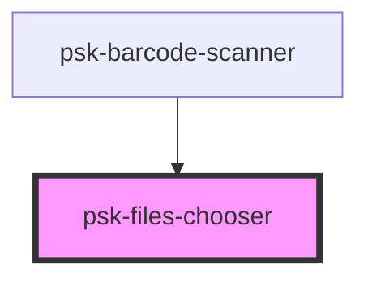

# psk-files-chooser

<!-- Auto Generated Below -->

## Properties

| Property    | Attribute    | Description | Type     | Default          |
| ----------- | ------------ | ----------- | -------- | ---------------- |
| `accept`    | `accept`     |             | `string` | `undefined`      |
| `eventName` | `event-name` |             | `string` | `undefined`      |
| `label`     | `label`      |             | `string` | `"Select files"` |

## Dependencies

### Used by

 - [psk-barcode-scanner](../psk-barcode/psk-barcode-scanner)

### Graph

----------------------------------------------

*Built with [StencilJS](https://stenciljs.com/)*
